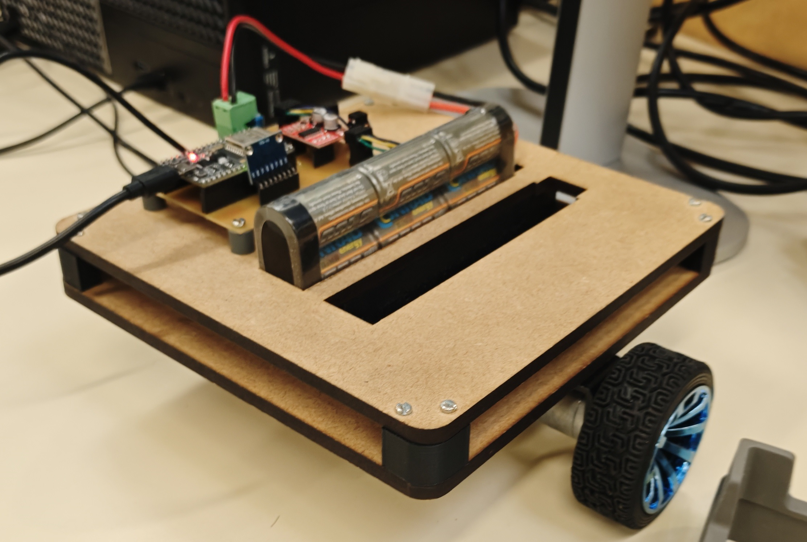

# Projet Robot Auto-Équilibré avec ESP32

<p align="center">
  
</p>

## Vue d'ensemble

Ce projet implémente un robot auto-équilibré (self-balancing robot) utilisant un microcontrôleur ESP32, un capteur IMU MPU6050 pour la mesure d'inclinaison, et des encodeurs rotatifs pour la mesure de vitesse des roues. Le système utilise un contrôleur PID pour maintenir l'équilibre du robot en ajustant la vitesse des moteurs.

Le code est écrit en C++ avec le framework Arduino et utilise PlatformIO pour la gestion du projet et la compilation.

## Matériel Requis

- **Microcontrôleur** : ESP32 (modèle esp32dev)
- **Capteur IMU** : MPU6050 (via I2C)
- **Encodeurs** : 2 encodeurs rotatifs pour les roues (broches CLK et DT)
- **Moteurs** : 2 moteurs DC avec pont en H (commandés via PWM)
- **Alimentation** : Source appropriée pour ESP32 et moteurs

### Schéma de Connexions

- **MPU6050** :
  - SDA : GPIO 22
  - SCL : GPIO 21

- **Encodeur Gauche** :
  - CLK : GPIO 26
  - DT : GPIO 27

- **Encodeur Droit** :
  - CLK : GPIO 18
  - DT : GPIO 19

- **Moteurs** :
  - Moteur Gauche : IN1 (GPIO 32), IN2 (GPIO 33)
  - Moteur Droit : IN3 (GPIO 17), IN4 (GPIO 16)

## Logiciels et Dépendances

- **PlatformIO** : Environnement de développement pour l'ESP32
- **Bibliothèques** :
  - Adafruit MPU6050 (version ^2.2.8)
  - ESP32Encoder (version ^0.12.0)
- **Framework** : Arduino

## Structure du Code

### Fichiers Principaux

- `src/main.cpp` : Code principal du robot
- `platformio.ini` : Configuration du projet PlatformIO

### Fonctionnement du Code

Le programme utilise un système multi-tâches avec FreeRTOS :

1. **Tâche de Contrôle (`controle`)** : Boucle principale exécutée toutes les `Te` millisecondes (par défaut 10ms)
   - Lit les données du MPU6050 (accéléromètre et gyroscope)
   - Calcule la vitesse des roues via les encodeurs
   - Fusionne les données IMU pour obtenir l'angle d'inclinaison
   - Applique le contrôle PID pour l'équilibre
   - Applique le contrôle de vitesse (boucle externe)
   - Génère les signaux PWM pour les moteurs

2. **Boucle Principale (`loop`)** : Affiche les données de débogage via Serial

3. **Gestion Série (`serialEvent` et `reception`)** : Permet de configurer les paramètres via le port série

### Variables et Paramètres Clés

- **Contrôle d'Équilibre** :
  - `Kp` : Gain proportionnel du PID
  - `Kd` : Gain dérivé du PID
  - `theta_cons` : Consigne d'angle (calculée à partir de la boucle vitesse)
  - `erreur` : Erreur angulaire

- **Filtrage IMU** :
  - `Tau` : Constante de temps du filtre complémentaire (ms)
  - `A`, `B` : Coefficients du filtre (calculés automatiquement)

- **Contrôle de Vitesse** :
  - `Kpvitesse` : Gain de la boucle vitesse
  - `vcons` : Consigne de vitesse (tours/s)
  - `vobs` : Vitesse observée (moyenne des deux roues)

- **Encodeurs** :
  - `top_gauche`, `top_droit` : Nombre d'impulsions par tour
  - `countG_prev`, `countD_prev` : Comptages précédents

- **Compensation** :
  - `C0` : Compensation des frottements
  - `theta_equilibre` : Offset d'équilibre mécanique

### Algorithme de Fusion de Capteurs

L'angle d'inclinaison est calculé en fusionnant les données de l'accéléromètre et du gyroscope :

1. **Angle Accéléromètre** : `thetaAccel = atan2(a.acceleration.y, a.acceleration.x) * 180 / PI`
2. **Filtrage Passe-Bas** : `theta_filtre = A * thetaAccel + B * theta_filtre`
3. **Intégration Gyroscope** : `theta_W = A * (Tau / 1000) * d_theta_gyroscope + B * theta_W`
4. **Fusion** : `theta_final = theta_W + theta_filtre + theta_equilibre`

## Installation et Configuration

1. **Installer PlatformIO** : Suivez les instructions sur https://platformio.org/

2. **Cloner ou Télécharger le Projet** : Placez les fichiers dans un dossier de projet PlatformIO

3. **Installer les Dépendances** : PlatformIO installera automatiquement les bibliothèques spécifiées dans `platformio.ini`

4. **Configurer le Matériel** : Assurez-vous que les connexions correspondent au schéma ci-dessus

5. **Compiler et Téléverser** :

   ```bash
   pio run -t upload
   ```

6. **Monitorer** : Ouvrez le moniteur série pour voir les données de débogage
   ```bash
   pio device monitor
   ```

## Utilisation

### Démarrage

Après téléversement, le robot devrait commencer à s'équilibrer automatiquement. Les paramètres par défaut peuvent nécessiter ajustement.

### Configuration via Série

Envoyez des commandes via le port série (115200 baud) pour ajuster les paramètres :

- `Tau <valeur>` : Constante de temps du filtre (ms)
- `Te <valeur>` : Période d'échantillonnage (ms)
- `Kp <valeur>` : Gain proportionnel
- `Kd <valeur>` : Gain dérivé
- `C0 <valeur>` : Compensation frottements
- `T0 <valeur>` : Offset équilibre mécanique
- `Kpv <valeur>` : Gain boucle vitesse
- `Vc <valeur>` : Consigne vitesse (tours/s)

Exemple : Envoyez `Kp 1.5` pour définir Kp à 1.5

### Données de Sortie

Le programme affiche périodiquement :

- `theta_filtre` : Angle accéléromètre filtré (°)
- `d_theta_gyroscope` : Vitesse angulaire gyro (°/s)
- `theta_final` : Angle fusionné (°)
- `vobs` : Vitesse observée (tours/s)

## Dépannage

- **MPU6050 non détecté** : Vérifiez les connexions I2C et l'alimentation
- **Robot ne s'équilibre pas** : Ajustez les gains PID (Kp, Kd) progressivement
- **Vitesse instable** : Réglez Kpvitesse et vérifiez les encodeurs
- **Décalage angulaire** : Ajustez theta_equilibre (T0)

## Améliorations Possibles

- Ajout d'un contrôleur de position (boucle externe supplémentaire)
- Implémentation d'un filtre Kalman pour une meilleure fusion de capteurs
- Ajout de communication sans fil (WiFi/Bluetooth) pour télémétrie
- Optimisation des performances avec interruption pour les encodeurs

## Licence

[Spécifiez la licence si applicable, par exemple MIT]

## Contributeurs

[Ajoutez les noms des contributeurs]

## Références

- Documentation PlatformIO : https://docs.platformio.org/
- Bibliothèque Adafruit MPU6050 : https://github.com/adafruit/Adafruit_MPU6050
- Bibliothèque ESP32Encoder : https://github.com/madhephaestus/ESP32Encoder
